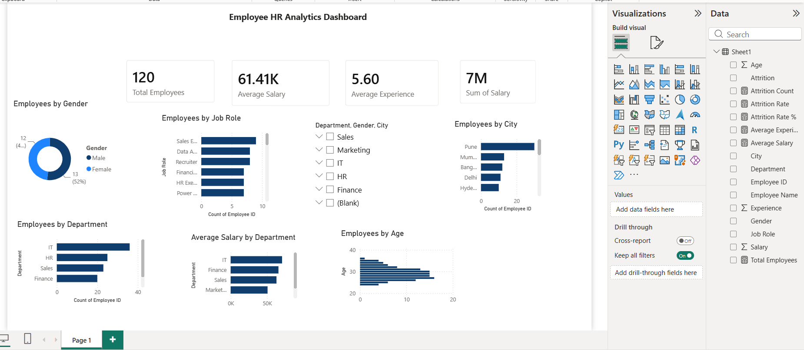

# Employee HR Analytics Dashboard 📊

## 📌 Project Overview

This project analyzes employee data to understand workforce trends, salary distribution, employee experience, and attrition.

The project combines Python for data analysis and Power BI for interactive dashboard visualization.

## 🛠️ Tools & Technologies

- Python
- Pandas
- NumPy
- Matplotlib
- Jupyter Notebook
- Power BI
- Excel

## 📊 Dataset

The dataset contains 120 employee records and 10 columns:

- Employee ID
- Employee Name
- Department
- Gender
- Age
- Salary
- Attrition
- Job Role
- Experience
- City

## 🔍 Key Analysis

The analysis covers:

- Department-wise employee distribution
- Gender distribution
- Employee attrition
- Average salary
- Department-wise average salary
- Average employee experience
- Department-wise experience analysis

## 📈 Key Insights

- Total Employees: 120
- Average Salary: ₹61,408
- Average Experience: 5.6 years
- Attrition Rate: 20.83%
- IT has the highest number of employees with 36 employees.
- Sales has the highest average experience at 7.09 years.
- Marketing has the lowest average experience at 4.12 years.

## 📊 Power BI Dashboard

The Power BI dashboard provides an interactive view of employee demographics, salary, experience and attrition.

## 🐍 Python Analysis

Python was used for:

- Data loading
- Data validation
- Missing value checking
- Duplicate checking
- Exploratory Data Analysis
- Statistical analysis
- Data visualization

## 📁 Project Files

- `Employee_HR_Analytics_Python.ipynb` – Python analysis notebook
- `Employee_HR_Dashboard.pbix` – Power BI dashboard
- `dashboard.png` – Dashboard preview

## 👩‍💻 Author

Sakshi
